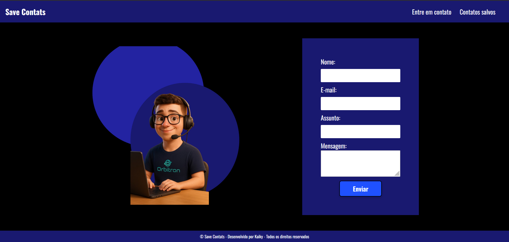

# 📇 Save Contats

Projeto de uma landing page com formulário para salvar contatos, desenvolvido com HTML, CSS e **JavaScript**.

O objetivo principal é permitir que usuários preencham um formulário com nome, e-mail, assunto e mensagem. Os dados são **armazenados localmente no navegador (localStorage)** e podem ser visualizados em outra página da aplicação.

O projeto também conta com uma imagem ilustrativa e links de navegação no cabeçalho.

---

## 🖼️ Print do projeto



---

## 🖥️ Tecnologias Utilizadas

- **HTML5**
- **CSS3**
- **JavaScript** (responsável pela lógica de manipulação e salvamento dos contatos)
- **Google Fonts**
  - Exo 2, Montserrat, Open Sans, Oswald, Poppins

---

## 📋 Funcionalidades

- Layout responsivo com estrutura básica de site
- Formulário com campos:
  - Nome
  - E-mail
  - Assunto
  - Mensagem
- Armazenamento local dos dados preenchidos (`localStorage`)
- Exibição dinâmica dos contatos salvos em uma tabela
- Navegação entre páginas sem perder os dados salvos
- Cabeçalho com links e rodapé com créditos

---

## 🧠 JavaScript (Desenvolvido por Kaiky)

Toda a lógica para:
- Captura dos dados do formulário
- Armazenamento dos contatos em `localStorage`
- Carregamento e exibição automática dos contatos em outra página

Foi desenvolvida por **Kaiky**, utilizando boas práticas como:
- Manipulação de DOM
- Eventos
- Conversão JSON
- Estrutura modular de código

---

## 🎨 Estilo

- **Cores predominantes:** Preto, Azul Escuro `#191970` e Azul Vivo `#1F51FF`
- **Fonte principal:** Oswald
- Interface moderna com foco em legibilidade e contraste visual
- Animações suaves em botões e links ao passar o mouse

---

## 📁 Estrutura de Arquivos

/
├── index.html # Página com o formulário
├── contatos.html # Página que exibe a tabela com os contatos salvos
├── style.css # Estilos da página
├── main.js # Lógica JS de manipulação e armazenamento
├── img/
│ └── TelaPrograma.png
│ └── Eu em pixar.png


---

## 🚀 Como Usar

1. Clone o repositório:
   ```bash
   git clone https://github.com/seu-usuario/save-contats.git

    Acesse a pasta do projeto:

    cd save-contats

    Abra o arquivo index.html no seu navegador.

🔧 Melhorias Futuras

    Validação de formulário com JavaScript

    Avisos de sucesso/erro no envio

    Layout mobile aprimorado com menu responsivo

    Exportar os contatos para .csv ou .pdf

👨‍💻 Desenvolvedor

Desenvolvido por Kaiky
© Save Contats - Todos os direitos reservados.